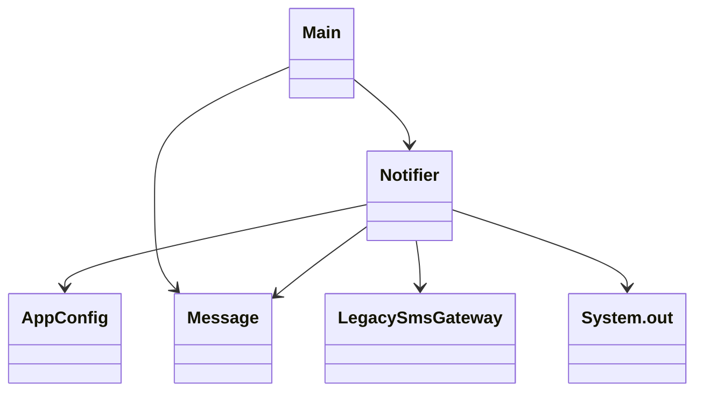
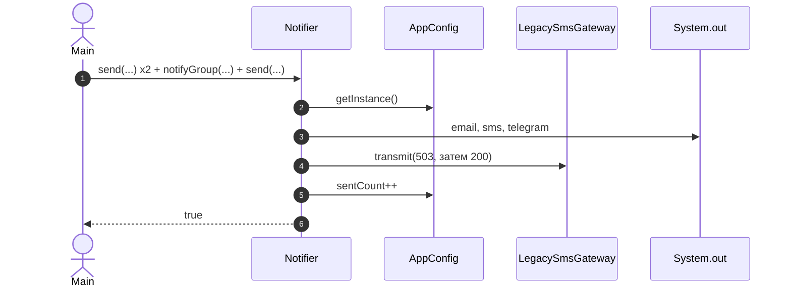
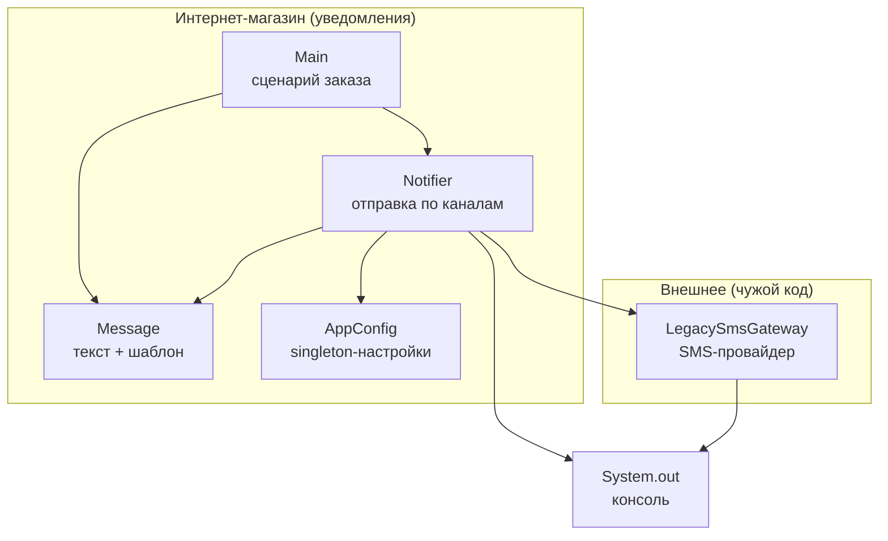

# Шпаргалка по Mermaid

Диаграмма пишется в блоке кода с языком `mermaid`. Предпросмотр в VS Code: расширение `bierner.markdown-mermaid`, затем `Cmd/Ctrl+Shift+V`.

## Диаграмма классов

| Связь | Как пишется | Что значит |
|---|---|---|
| Наследование | `Base <\|-- Child` | Child это Base |
| Реализация интерфейса | `Interface <\|.. Impl` | Impl выполняет контракт Interface |
| Композиция | `Owner *-- Part` | Part живет внутри Owner и без него не существует |
| Агрегация | `Group o-- Member` | Group содержит Member, но Member живет и сам |
| Ассоциация | `A --> B` | A хранит ссылку на B |
| Зависимость | `A ..> B` | A пользуется B (параметр, создание) |

Видимость: `+` публичное, `-` приватное. Подпись связи после двоеточия: `A --> B : создает`.

## Диаграмма последовательности

`->>` вызов, `-->>` ответ, `loop` повтор, `alt` / `else` развилка.

## Компонентная диаграмма

В Mermaid нет отдельного типа, используем `flowchart`:

Стрелка значит «использует». `LR` слева направо, `TD` сверху вниз.
