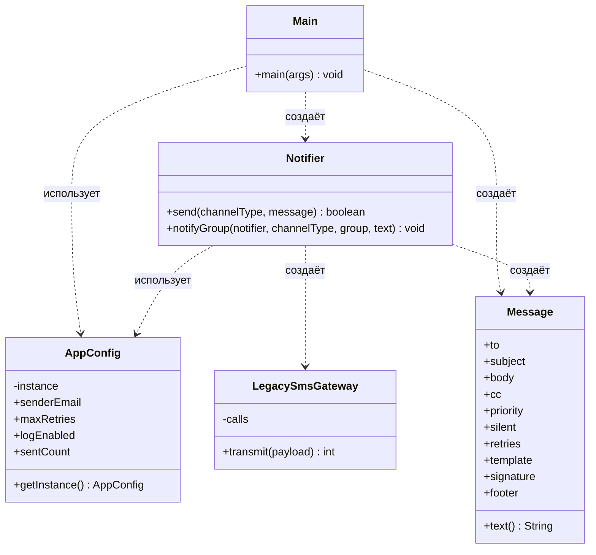
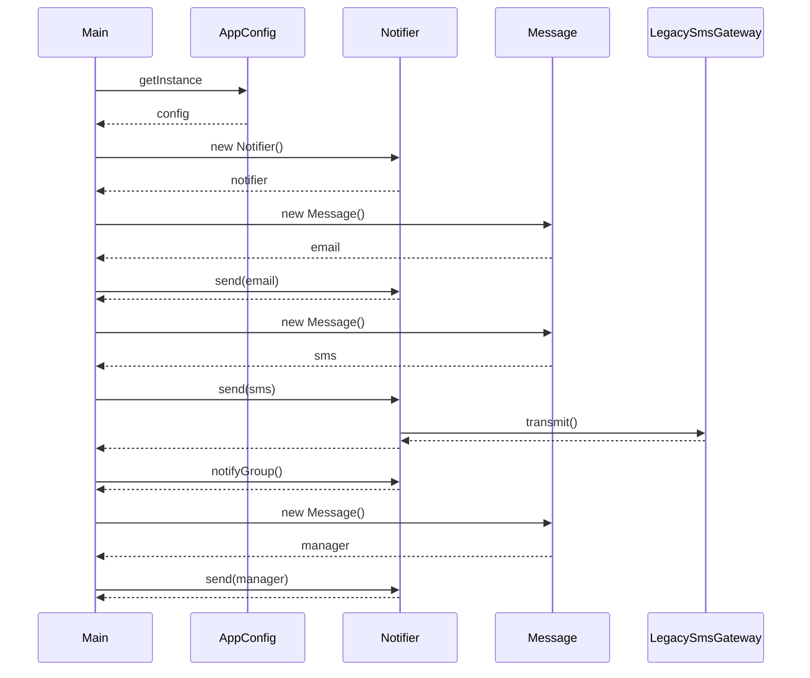

## Диаграмма классов

```mermaid
classDiagram
    class Main {
        +main(args) void
    }
    class AppConfig {
        -instance
        +senderEmail
        +maxRetries
        +logEnabled
        +sentCount
        +getInstance() AppConfig
    }
    class LegacySmsGateway {
        -calls
        +transmit(payload) int
    }
    class Message {
        +to
        +subject
        +body
        +cc
        +priority
        +silent
        +retries
        +template
        +signature
        +footer
        +text() String
    }
    class Notifier {
       +send(channelType, message) boolean
       +notifyGroup(notifier, channelType, group, text) void
    }
    Main ..> AppConfig : использует
    Main ..> Notifier : создаёт
    Main ..> Message : создаёт
    Notifier ..> LegacySmsGateway : создаёт
    Notifier ..> Message : создаёт
    Notifier ..> AppConfig : использует
```

## Диаграмма последовательности

```mermaid
sequenceDiagram
    participant M as Main
    participant AC as AppConfig
    participant N as Notifier
    participant ME as Message
    participant G as LegacySmsGateway

    M->>AC: getInstance
    AC-->>M: config
    M->>N: new Notifier()
    N-->>M: notifier
    M->>ME: new Message()
    ME-->>M: email
    M->>N: send(email)
    N-->>M:
    M->>ME: new Message()
    ME-->>M: sms
    M->>N: send(sms)
    N->>G: transmit()
    G-->>N:
    N-->>M:
    M->>N: notifyGroup()
    N-->>M:
    M->>ME: new Message()
    ME-->>M: manager
    M->>N: send(manager)
    N-->>M:
```